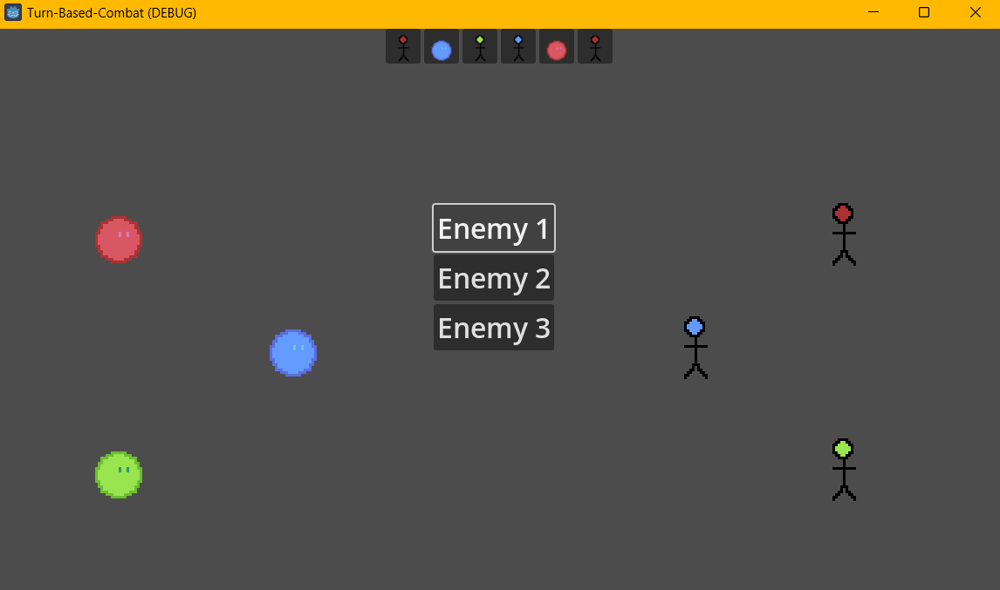

# Godot-Turn-Based-Combat
 
- Character `Resources`
    - Agility -> Higher Agility = Lower Speed(Down Time)
    - Speed(Down Time/Rest Time)
    - Status -> Effect like Haste, Slow can influence the agility

